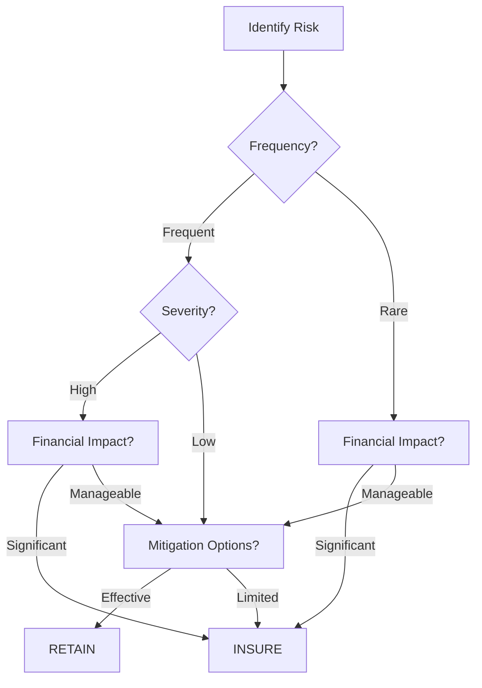

# RiskDecider 🛡️

## Overview

RiskDecider is an intelligent decision support system that implements a professional risk assessment framework through an interactive decision tree interface. Built with R Shiny and DiagrammeR, it helps organizations make data-driven risk management decisions.

## Key Features

✅ **Dynamic Decision Tree Visualization**  
✅ **Risk Assessment Framework**  
✅ **Real-time Decision Logic**  
✅ **Professional Risk Reporting**  
✅ **Interactive Scenario Analysis**

## Decision Framework

## Usage

1. Risk Identification
- Describe your potential risk scenario in the input field

2. Frequency Assessment
- Select between Frequent/Rare occurrence

3. Severity Evaluation
- For frequent risks, assess High/Low severity

4. Financial Analysis
- Evaluate potential financial impact (Significant/Manageable)

5. Mitigation Review
- Consider available risk mitigation strategies

